<!-- portfolio:start -->
<p align="center">
  
</p>

<h1 align="center">LifePilot</h1>

<p align="center"><strong>A friendly planner for turning messy tasks into a realistic day, both on web and terminal.</strong></p>

<p align="center">

  
  
</p>

## Daily Cockpit

LifePilot is intentionally softer than a productivity dashboard: it feels like a calm planning desk instead of a corporate tool.

## What It Solves

Breaks tasks into priorities, time blocks, and a schedule that is realistic enough to actually follow.

## Terminal Use

`npm install -g github:Alfredo-ctrl/lifepilot` then run `lifepilot --demo`.

## Portfolio Note

This repository has its own visual identity inside the portfolio. The goal is that every project feels like a different product, not another copy of the same template.
<!-- portfolio:end -->

---

## Existing Project Notes

# lifepilot

lifepilot is a friendly planning tool that turns a messy list of tasks into a clear daily schedule. It is designed for students, freelancers, builders, and anyone who starts the day with too many things floating around.

The project includes a web app and a terminal interface. Both work locally, with no accounts, no backend, and no external services.


## What It Does

- Converts plain text tasks into a structured day plan.
- Detects task types such as study, work, errands, health, messages, and rest.
- Estimates effort, energy, priority, and best time of day.
- Builds a realistic timeline with breaks.
- Warns when the day is overloaded.
- Creates a simple focus brief for the user.
- Exports plans as JSON or plain text.
- Runs from the browser or terminal.

## Why It Helps

Most planning apps expect people to already know how to organize their day. lifepilot starts one step earlier: the user can paste a rough brain dump, and the app shapes it into something usable.

Example input:

```text
class at 10
study python for 2 hours
send my resume
go to the gym
reply to emails
sleep early
```

lifepilot will produce a timeline, highlight the heaviest tasks, and suggest a better rhythm for the day.

## Run The Web App

```bash
npm start
```

Open:

```text
http://localhost:5174
```

You can also open `index.html` directly.

## Run The Terminal App

Install it from GitHub as a real terminal command:

```bash
npm install -g --foreground-scripts https://github.com/Alfredo-ctrl/lifepilot/archive/refs/heads/main.tar.gz
```

Then run:

```bash
lifepilot
```

Try the demo:

```bash
lifepilot --demo
```

Interactive mode:

```bash
python lifepilot.py
```

Plan from a text file:

```bash
python lifepilot.py --file examples/day.txt
```

Export JSON:

```bash
python lifepilot.py --file examples/day.txt --json
```

The npm command uses the JavaScript CLI. The Python command stays available for people who prefer running the local script directly.

## Project Structure

```text
lifepilot/
  index.html
  package.json
  bin/
    lifepilot.js
    postinstall.js
  lifepilot.py
  src/
    app.js
    planner.js
    styles.css
  examples/
    day.txt
```

## Design Goal

lifepilot is intentionally simple to understand. The intelligence is in the planning engine, but the interface feels like a useful everyday tool rather than a technical demo.

## Author

Alfredo Oliva
